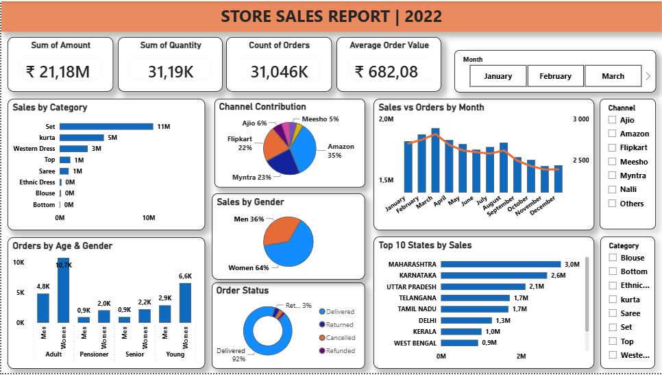

#  Vrinda Store Sales Analysis 
##  Project Overview

This project analyzes Vrinda store sales data to identify sales trends,
customer purchasing behaviour, sales performance, and business
opportunities. 

### Objective
Analyze sales and customer purchasing patterns to identify revenue drivers, high-performing markets and channels, and opportunities for business growth.

## Data Source

**Source:** Kaggle  
**Dataset:** Vrinda Store Sales 
**Link:** [Download here](https://www.kaggle.com/datasets/amitkumar209/vrinda-store-sales-data)

## Skills Demonstrated

- Data Cleaning & Transformation
- SQL Data Analysis
- Exploratory Data Analysis
- Business KPI Development
- Power BI Dashboard Development
- Data Visualization
- Business Insights & Recommendations

## Business Questions

1. What are the total revenue and orders?
2. Which category generates the most revenue?
3. Which gender contributes the most revenue?
4. Which age group generates the most revenue?
5. Which month has the highest revenue?
6. Which channels generate the most orders?
7. Show different orders status?
8. Which states generate the most revenue?
   
## Tools Used

- SQL Server – Data storage, cleaning, and removing duplicates analysis
- SQL – Data transformation & formatting dates and business analysis
- Power BI – Data visualization and interactive dashboard
- Excel/CSV – Source dataset

## Project Workflow

Raw Dataset
    →
SQL Server
    →
Exploratory Data Analysis (EDA)
    →
Data Cleaning & Transformation
    →
SQL Data Analysis
    →
Power BI Dashboard
    →
Business Insights

[View SQL Queries](SQL_Store_Sales_Analysis.sql)

## Dashboard

The Power BI dashboard contains:

### KPI

- Total Revenue: ₹ 21.18M
- Total Orders: 31.05K
- Total Quantity Sold: 31.19K
- Average Order Value: ₹ 682

### Visualizations

- Monthly Sales Trend (Column Chart)
- Sales by Category (Bar Chart)
- Sales by Gender (Pie Chart)
- Sales by State (Bar Chart)
- Sales by Sales Channel (Pie Chart)
- Orders by Age & Gender (Column Chart)
- Order Status (Donut Chart)

## Key Insights

- Women represent the largest customer segment by revenue contribution 64%.
- Customers aged 30–49 generated the largest share of sales, highlighting the Adult age group as a key target market.
- Set, Kurta, and Western Dress were the top-performing categories, collectively contributing 88% of total revenue, making them the primary drivers of product revenue.
- Q1 recorded the highest quarterly revenue, indicating strong sales performance during the first quarter.
- Maharashtra, Karnataka, and Uttar Pradesh were the top three reveue-generating states, highlighting these regions as key markets for the business.
- Amazon, Myntra, and Flipkart collectively generated 80% of total revenue, demonstrating the importance of these platforms to overall business performance.

## Recommendations

- Target women aged 30–49 with personalized marketing campaigns, product recommendations, and offers tailored to their purchasing preferences.
- Strengthen the Amazon, Myntra, and Flipkart channels by using targeted advertising, exclusive offers, and promotional coupons to increase customer engagement and sales.
- Increase inventory and staffing ahead of Q1 to prepare for historically higher demand and reduce the risk of stockouts or fulfillment delays.
- Investigate low-performing states to identify barriers to sales growth and develop targeted strategies such as regional promotions, localized marketing, and improved product availability.
